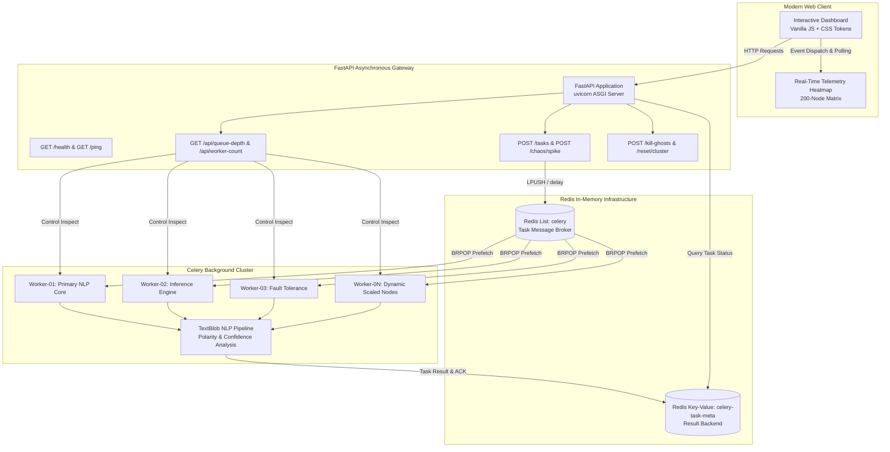

<div align="center">

# ⚡ Distributed AI Task Scheduler & Chaos Engineering Engine

[](https://fastapi.tiangolo.com)
[](https://docs.celeryq.dev)
[](https://redis.io)
[](https://python.org)
[](LICENSE)
[](#-live-demo)
[](#)

<p align="center">
  <strong>An enterprise-grade, asynchronous distributed task orchestrator featuring real-time telemetry matrix heatmaps, dynamic horizontal autoscaling, fault injection chaos engineering, and real OS worker observability.</strong>
</p>

---

### 🚀 [View Live Demo on Render](https://distributed-ai-scheduler-web.onrender.com/dashboard)
*(Click above to interact with the live cluster and launch traffic spikes)*

---

</div>

## 📸 System Dashboard

<div align="center">
  
  <p><em>Real-Time Observability Deck: Live Telemetry Heatmap, Dynamic Worker Cluster, Sentiment Inference Engine, and Chaos Controls.</em></p>
</div>

> [!NOTE]
> *Replace `docs/images/dashboard_preview.png` with a live capture or GIF of your deployed dashboard in action.*

---

## ✨ Key Features

- **⚡ Asynchronous NLP Inference Engine:** Offloads computational NLP sentiment analysis (polarity scoring, confidence calculation) from the HTTP thread into an asynchronous Celery worker cluster powered by Redis.
- **📈 Dynamic Horizontal Auto-Scaling:** Add live worker nodes on the fly with a single click (`➕ Scale Out`). Spawns dedicated OS worker processes silently in the background on both Windows and Linux environments.
- **🔥 Chaos Engineering & Fault Injection:** Built-in chaos suite dispatches 50-task traffic bursts and injects 50% simulated node failures to demonstrate Celery's automatic exponential retry backoff, late acknowledgment (`task_acks_late`), and dead-letter recovery.
- **📊 Real-Time Task Telemetry Matrix (GitHub-Style Heatmap):** Live visual matrix tracking tasks from `Queued` (⚪) to `Processing` (🔵) to `Success` (🟢) or `Failed` (🔴) with an in-memory circular buffer for zero layout shift.
- **👻 "Ghost Busters" OS Worker Observability:** Dynamic 3-second heartbeat polls the underlying operating system (`inspect.ping()` & `stats()`), mathematically calculates unmanaged zombie workers ($\text{Ghosts} = \text{OS} - \text{UI}$), and surfaces a permanent health status deck.
- **🎯 Surgical Ghost Process Purge:** Selective `/kill-ghosts` API shuts down rogue background workers without resetting active queues, activity feeds, or scaled UI nodes.

---

## 🏛️ System Architecture



---

## 🛠️ Technology Stack

| Layer | Technology | Version | Purpose & Architectural Role |
| :--- | :--- | :--- | :--- |
| **API Gateway** | [FastAPI](https://fastapi.tiangolo.com/) | `0.95.0` | Asynchronous ASGI Web framework handling REST endpoints and static assets. |
| **Task Queue** | [Celery](https://docs.celeryq.dev/) | `5.2.7` | Distributed task orchestration, retry backoff policies, and late acknowledgment. |
| **Message Broker** | [Redis](https://redis.io/) | `4.5.4+` | In-memory message broker (List queue) and distributed result store. |
| **NLP Compute** | [TextBlob](https://textblob.readthedocs.io/) | `0.17.1` | Natural Language Processing pipeline calculating sentiment polarity and confidence. |
| **Web Server** | [Uvicorn](https://www.uvicorn.org/) | `0.21.1` | Lightning-fast ASGI production web server. |
| **Frontend UI** | HTML5 / CSS3 / ES6 | Native | Pure vanilla CSS tokens, responsive flex/grid layouts, and zero external JS bloat. |
| **Cloud Infra** | [Render](https://render.com/) | Cloud | One-click Infrastructure as Code deployment via declarative `render.yaml`. |

---

## 🚀 Quick Start Guide (Local Setup in 5 Steps)

Follow these steps to run the distributed scheduler locally on your machine:

### 1. Clone the Repository
```bash
git clone https://github.com/YOUR_USERNAME/distributed-ai-task-scheduler.git
cd distributed-ai-task-scheduler
```

### 2. Start Redis
Ensure Redis is running locally on port `6379`:
```bash
# Using Docker (Recommended)
docker run -d -p 6379:6379 --name local-redis redis:alpine

# Or verify local service
redis-cli ping
# Output: PONG
```

### 3. Install Python Dependencies
```bash
python -m venv .venv
# Windows:
.venv\Scripts\activate
# macOS/Linux:
source .venv/bin/activate

pip install -r requirements.txt
```

### 4. Start Celery Background Workers
Open a separate terminal and start the Celery worker process:
```bash
# Windows (Solo Pool):
celery -A project.worker.celery worker --loglevel=info -P solo

# macOS / Linux (Prefork Pool):
celery -A project.worker.celery worker --loglevel=info --concurrency=3
```

### 5. Launch FastAPI Web Gateway
In your main terminal, start the web server:
```bash
uvicorn project.main:app --host 127.0.0.1 --port 8000 --reload
```

Navigate to **`http://localhost:8000/dashboard`** in your browser! 🎉

---

## ☁️ 1-Click Cloud Deployment (Render)

This repository includes a turnkey [`render.yaml`](render.yaml) blueprint specification for instant cloud deployment.

### How to Deploy:
1. Push your repository to **GitHub**.
2. Log into [Render Dashboard](https://dashboard.render.com/) and click **New +** ➔ **Blueprint**.
3. Select this repository. Render will automatically provision:
   - **Web Service:** `distributed-ai-scheduler-web` (FastAPI via Uvicorn)
   - **Worker Service:** `distributed-ai-scheduler-worker` (Celery Cluster)
   - **Managed Redis:** `redis-cache` (Zero-config connection string injection)
4. Click **Apply** to deploy the live cluster in under 2 minutes.

---

## 🛡️ Chaos & Fault Tolerance Matrix

| Scenario | Injected Condition | Cluster Defense Mechanism | Expected Outcome |
| :--- | :--- | :--- | :--- |
| **50-Task Spike** | 50 concurrent requests | Redis list buffering + sequential queue dispatcher | Zero HTTP 500s; tasks stream cleanly into available nodes. |
| **Worker Crash** | `CRASH_SIMULATION` payload | `task_acks_late=True` + `task_reject_on_worker_lost` | Node marks `CRASHED 💀`; task auto-requeues without loss. |
| **Network Lag** | Transient polling timeout | Client-side exponential retry + defensive state cache | Activity log and status cards remain intact without UI freezing. |
| **Zombie Accumulation** | Rogue processes on OS | `POST /kill-ghosts` selective shutdown signal | Terminates ghost PIDs while preserving in-flight tasks and logs. |

---

## 🤝 Contributing & License

Contributions, issues, and feature requests are welcome! Feel free to check the [issues page](https://github.com/YOUR_USERNAME/distributed-ai-task-scheduler/issues).

Distributed under the **MIT License**. See [`LICENSE`](LICENSE) for more information.

<div align="center">
  <sub>Engineered with precision for resilient, observable distributed computing.</sub>
</div>
